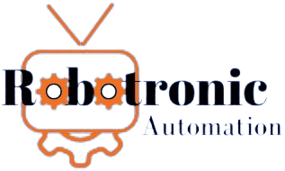

	

 
<h1 align="center">
	
 Get to know About Us 
	
</h1>

We are a leading automation consulting company dedicated to transforming the food industry through the implementation of advanced technologies.

Our vision is to spearhead this change, becoming the undisputed benchmark in robotic solutions and automation systems. Founded with the mission to revolutionize the industry, our passion for innovation drives every project we undertake.

 

<h1 align="center">
	
 Projects 
	
</h1>
<h3 align="center">
	
 Ositos Lulú Packaging 

</h3>

Design and implementation of the automation of the industrial process of packaging cupcakes of the company “Galletas Fontaneda”. It has been carried out the development of a communication strategy between technological devices with MQTT, a simulation of the robotic cell using the RoboDK tool, a system for collecting data generated by the company in a noSQL database, as well as the inclusion of advanced programming data structures.

 

<h1 align="center">
	
 Contact 
	
</h1>

	
	
	

